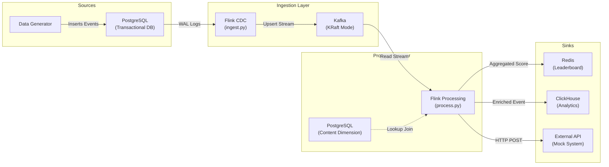

# Flink Engagement Pipeline

A real-time streaming data pipeline that captures user engagement events from PostgreSQL, processes them using Apache Flink, and routes enriched data to multiple sinks for analytics and operational use cases.

## 🏗️ Architecture



## 🚀 Features

*   **Change Data Capture (CDC)**: Captures inserts/updates from PostgreSQL using `flink-connector-postgres-cdc` with the `pgoutput` plugin.
*   **Stream Enrichment**: Performs a temporal lookup join with a PostgreSQL dimension table to enrich raw events with content metadata (title, type, length).
*   **Windowed Aggregation**: Calculates real-time engagement scores using sliding windows (HOP) and maintains a leaderboard in Redis.
*   **Multi-Sink Routing**:
    *   **Redis**: Real-time "Most Engaging Content" leaderboard.
    *   **ClickHouse**: High-performance columnar storage for historical analysis.
    *   **External API**: Simulates pushing data to a 3rd party system via HTTP.


## 🛠️ Prerequisites

*   **Docker** and **Docker Compose** installed.
*   **Git** for version control.
*   Minimum **4GB RAM** allocated to Docker (Flink and Kafka can be memory hungry).

## 🏃‍♂️ Quick Start

### 1. Start the Infrastructure
Initialize all services (Postgres, Kafka, Flink, Redis, ClickHouse):
```bash
docker-compose up -d --build
```
*Wait about 30-60 seconds for the Flink JobManager and TaskManager to fully start.*

### 2. Submit the Flink Jobs
The pipeline consists of two separate jobs:

**Job 1: Ingestion (CDC Source → Kafka)**
Reads the Postgres WAL and pushes changes to the `engagement_events` Kafka topic.
```bash
docker exec jobmanager flink run -py /opt/flink/usrlib/ingest.py -d
```

**Job 2: Processing (Kafka → Enrichment → Sinks)**
Consumes from Kafka, enriches data, and routes to Redis, ClickHouse, and the External API.
```bash
docker exec jobmanager flink run -py /opt/flink/usrlib/process.py -d
```

### 3. Verify the Pipeline
Check if both jobs are running:
```bash
docker exec jobmanager flink list
```

## 🔍 Monitoring & Verification

You can verify data flow at each stage of the pipeline:

### 1. Data Generator
View the logs to see raw events being inserted into Postgres:
```bash
docker logs -f datagen
```

### 2. Redis Leaderboard
Check the real-time leaderboard for top content:
```bash
docker exec redis redis-cli ZRANGE leaderboard 0 -1 WITHSCORES
```

### 3. ClickHouse Analytics
Query the enriched data stored in ClickHouse:
```bash
docker exec clickhouse clickhouse-client --query "SELECT * FROM engagement_enriched LIMIT 5 FORMAT PrettyCompact"
```

### 4. External System
Check logs to see events received via HTTP:
```bash
docker logs -f external-system
```

## 📂 Project Structure & File Explanations

### Source Code (`src/`)
*   **`ingest.py`**: The entry point for the ingestion layer. It defines a Flink SQL job that uses the PostgreSQL CDC connector to read the Write-Ahead Log (WAL) from the database and writes change events to a Kafka topic (`engagement_events`) in Upsert mode.
*   **`process.py`**: The core processing logic. It reads from Kafka, performs a temporal lookup join with the PostgreSQL `content` table (via a view) to enrich events, calculates windowed aggregations for the leaderboard, and routes data to Redis, ClickHouse, and the external API.
*   **`datagen.py`**: A Python script that acts as the data producer. It connects to PostgreSQL and continuously inserts random content and engagement events to simulate live user traffic.
*   **`mock_external.py`**: A lightweight Flask application that listens on port 5000. It serves as a mock destination for the "External System" sink, logging any received events to stdout for verification.

### Infrastructure & Configuration
*   **`docker-compose.yml`**: The master orchestration file. It defines and links all 7 services: Postgres, Kafka, Flink JobManager, Flink TaskManager, Redis, ClickHouse, Data Generator, and the External System. It handles networking, ports, and volume mounts.
*   **`Dockerfile.flink`**: A custom Docker image definition for Flink. It extends the base Flink image by downloading and installing necessary JAR connectors (Kafka, JDBC, Postgres CDC) so they are available at runtime.
*   **`Dockerfile.datagen`**: Defines the environment for the data generator, installing Python dependencies like `psycopg2` and `faker`.
*   **`Dockerfile.external`**: Defines the environment for the mock external system, installing `flask`.
*   **`sql/init.sql`**: The database initialization script. It runs automatically when the Postgres container starts, creating the `content` and `engagement_events` tables, setting replication identity for CDC, and creating the `content_dim_view` to handle UUID type casting.
